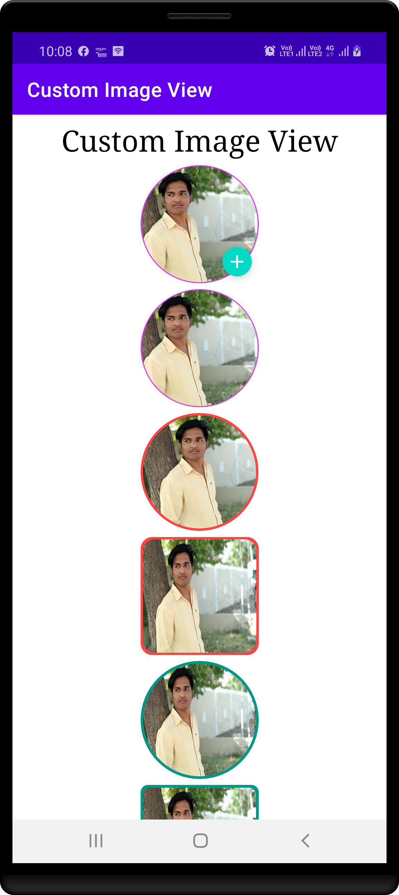
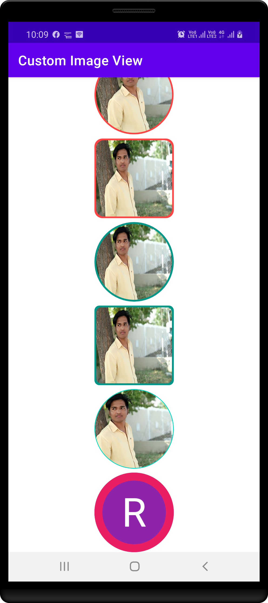
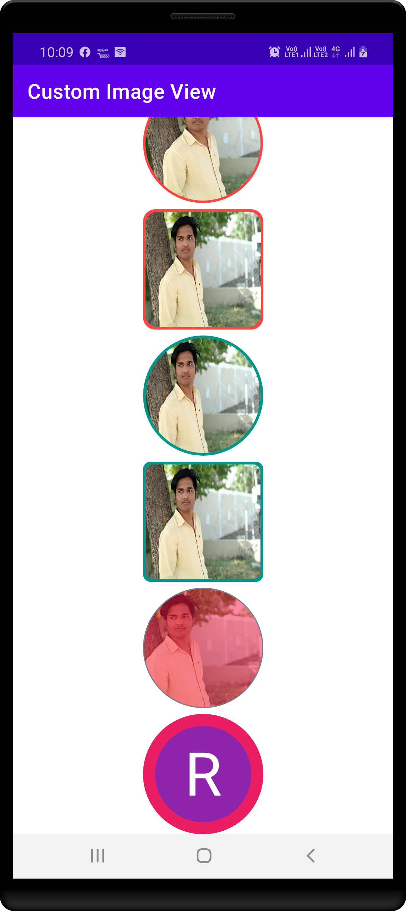

# JAVA - Custom Image View Made Easy

This code helps you to Create Custom Image View in your app with few lines of code.

Let CustomImageView support

- Circle Image
- Rounded Corner Image
- Circle Image Clickable
- Name First Character Circle Image

|    First 1   |     First 2     |     First 3     |
|--------------|-----------------|-----------------|
|  |  |  |

## Author ##

Rohit Yadav

[rohitnotes24@gmail.com](mailto:rohitnotes24@gmail.com)

[http://badasoftware.com/](http://badasoftware.com/)
